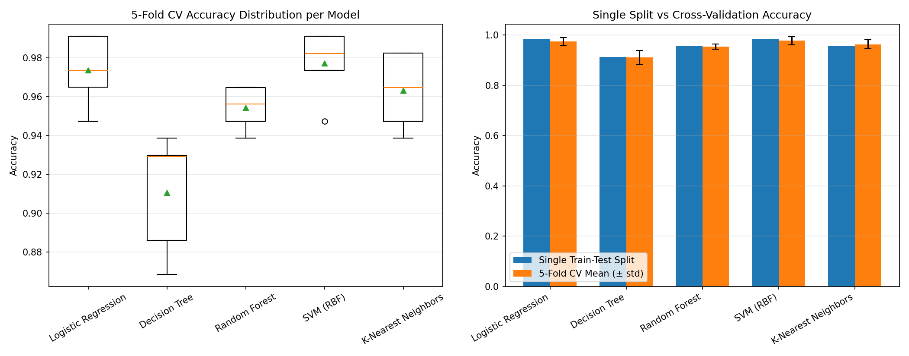

# Day 25 — Cross-Validation Performance Comparison Report

**Topic:** Cross-Validation Techniques for Reliable Model Evaluation
**Dataset:** Breast Cancer Wisconsin (sklearn built-in) — 569 samples, 30 features, binary classification
**Method:** 5-Fold Stratified Cross-Validation vs. a single 80/20 train-test split

---

## 1. Objective

A single train-test split gives one accuracy number that depends heavily on *which* rows ended up in the test set. K-fold cross-validation instead trains and evaluates the model K times on different splits, giving a **distribution** of scores rather than a single point estimate — a much more reliable signal for production readiness.

## 2. Models Evaluated

| # | Model | Notes |
|---|-------|-------|
| 1 | Logistic Regression | Scaled features, linear decision boundary |
| 2 | Decision Tree | No scaling needed, prone to overfitting |
| 3 | Random Forest (200 trees) | Ensemble, generally more stable |
| 4 | SVM (RBF kernel) | Scaled features, sensitive to feature scale |
| 5 | K-Nearest Neighbors | Scaled features, sensitive to local noise |

## 3. Results Table

| Model | Single Split Acc | CV Mean Acc | CV Std Dev | CV Min | CV Max | Gap (Single − CV Mean) |
|---|---|---|---|---|---|---|
| SVM (RBF) | 0.9825 | 0.9772 | 0.0163 | 0.9474 | 0.9912 | +0.0053 |
| Logistic Regression | 0.9825 | 0.9737 | 0.0166 | 0.9474 | 0.9912 | +0.0088 |
| K-Nearest Neighbors | 0.9561 | 0.9631 | 0.0179 | 0.9386 | 0.9825 | −0.0070 |
| Random Forest | 0.9561 | 0.9543 | 0.0102 | 0.9386 | 0.9649 | +0.0018 |
| Decision Tree | 0.9123 | 0.9104 | 0.0279 | 0.8684 | 0.9386 | +0.0019 |

*(Full per-fold numbers are in `cv_fold_scores.csv`.)*

## 4. Stability Ranking (lower std dev = more consistent)

1. **Random Forest** — std dev 0.0102 (most stable)
2. SVM (RBF) — std dev 0.0163
3. Logistic Regression — std dev 0.0166
4. K-Nearest Neighbors — std dev 0.0179
5. **Decision Tree** — std dev 0.0279 (least stable)

## 5. Visual Comparison

- **Left (boxplot):** spread of accuracy across the 5 folds per model. Decision Tree has the widest box and whiskers — its performance swings the most depending on which data it sees. Random Forest's box is the tightest.
- **Right (bar chart):** single split accuracy vs. CV mean accuracy (error bars = std dev). Every model's single-split bar sits close to its CV mean here, but the error bars show how much that single number could have shifted with different luck of the draw.

## 6. Reliability Observations

- **Single split can mislead in either direction.** Logistic Regression's single-split accuracy (0.9825) overstated its true average performance (0.9737) by 0.88 points — an easy test fold in that one split. KNN's single split (0.9561) *understated* its CV mean (0.9631) — an unusually hard test fold. Neither error is visible without running CV.
- **Decision Tree is the least trustworthy of this group.** Its CV std dev (0.0279) is roughly 2–3× that of the other models, and its fold-to-fold range spans 0.8684–0.9386. A single lucky/unlucky split could make it look far better or worse than it really is — a red flag for production use without pruning, depth limits, or ensembling.
- **Random Forest is the most production-ready by stability.** Despite not having the top mean accuracy, its low std dev (0.0102) means its behavior is the most predictable across unseen data — often more valuable in production than squeezing out the last bit of mean accuracy.
- **High mean accuracy alone isn't sufficient for model selection.** SVM and Logistic Regression have the best CV means, but a model selection process should weigh mean *and* variance together (e.g., prefer the model with best mean minus one std dev — a simple risk-adjusted score).
- **Takeaway for production systems:** always report CV mean ± std dev (or a confidence interval) instead of a single train-test accuracy number. It surfaces both expected performance and the uncertainty around it, which is what actually matters when predicting how a model will behave on new, unseen real-world data.

## 7. Files Produced

- `day25.py` — full cross-validation script
- `cv_fold_scores.csv` — raw per-fold accuracy for every model
- `performance_comparison.csv` — summary comparison table
- `cv_comparison_plots.png` — boxplot + bar chart visualization
- `day25_performance_report.md` — this report
