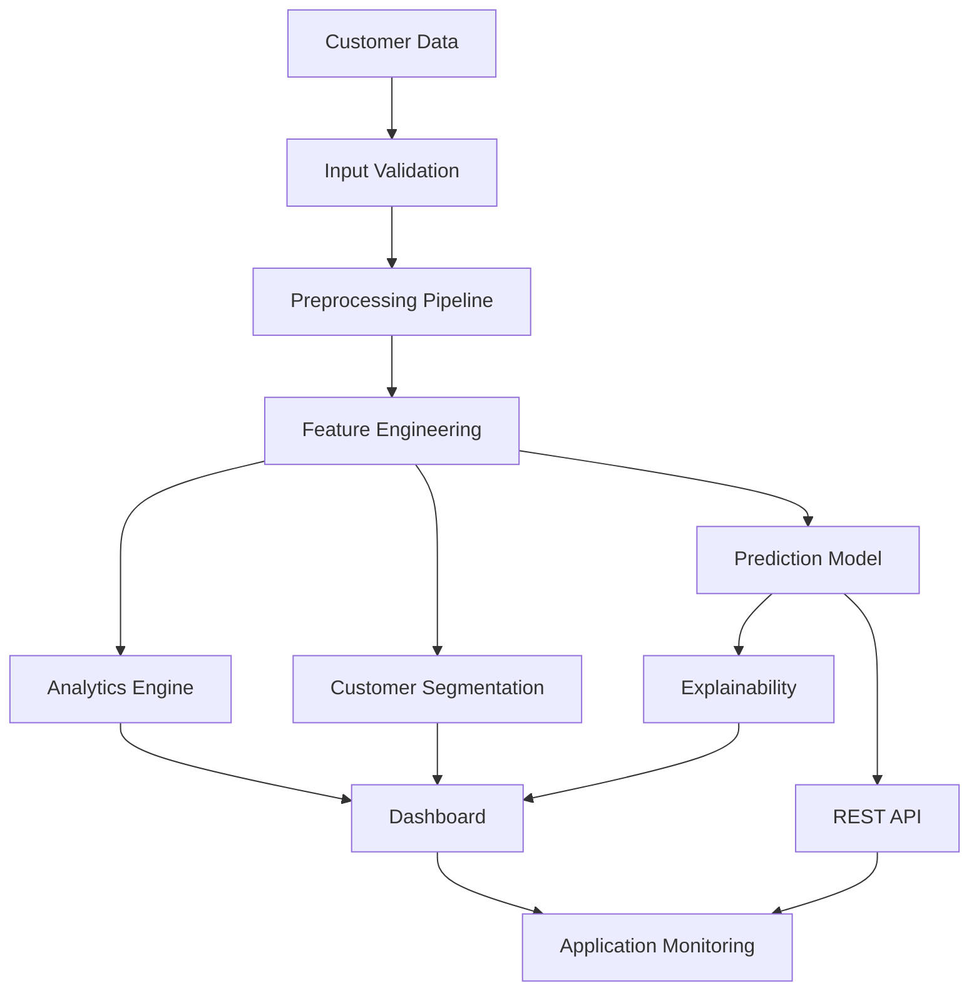
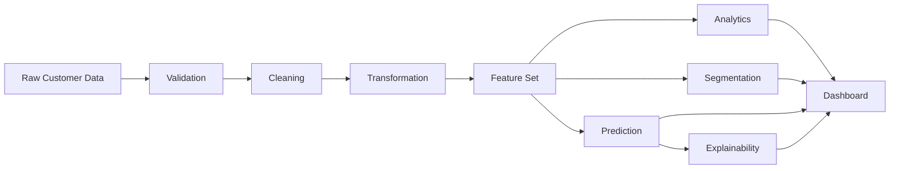

# Architecture & Workflow Documentation

## 1. Purpose

The Customer Intelligence Platform follows a modular architecture so data processing, analytics, machine learning, API services, and visualization can evolve independently.

## 2. Logical Architecture



## 3. Data Flow



## 4. Component Responsibilities

### Data Validation
Checks whether incoming data satisfies expected structural and quality requirements.

Typical checks:
- Required columns
- Data types
- Missing values
- Numeric ranges
- Duplicate records
- Invalid categorical values

### Preprocessing
Converts validated raw data into model-ready features.

Typical operations:
- Missing-value treatment
- Encoding
- Scaling
- Feature selection
- Feature engineering

### Analytics Engine
Provides descriptive and diagnostic insights such as:
- Customer counts
- Distribution summaries
- Segment statistics
- Trend metrics
- Business KPIs

### Segmentation Engine
Groups customers based on selected behavioral or business features.

The final segmentation method and number of clusters should be documented according to the implementation.

### Prediction Engine
Uses trained machine-learning models to generate customer-level predictions.

A production implementation should record:
- Model name
- Model version
- Feature schema
- Prediction timestamp
- Output class / value
- Confidence or probability when applicable

### Explainability Layer
Provides interpretable evidence for model predictions, such as feature importance or SHAP-based explanations.

### API Layer
Provides programmatic access to prediction services and health checks.

### Dashboard
Communicates the output of analytics and machine learning through interactive visual components.

### Monitoring
Captures application behavior, failures, and operational signals.

## 5. End-to-End Workflow

```text
User / Data Source
       |
       v
Data Input
       |
       v
Validation -----> Invalid Input -----> Error Response
       |
       v
Preprocessing
       |
       +---------> Analytics
       |
       +---------> Segmentation
       |
       +---------> Prediction
                         |
                         v
                   Explainability
                         |
                         v
                    API / Dashboard
                         |
                         v
                 Logging & Monitoring
```

## 6. Deployment Architecture

A practical deployment can separate the presentation layer from the prediction service:

```text
+-------------------+       HTTP/HTTPS       +----------------------+
| Web Dashboard     | ---------------------> | Prediction API       |
| Visualization     |                        | Model + Preprocessing|
+-------------------+                        +----------+-----------+
                                                       |
                                                       v
                                             +----------------------+
                                             | Data / Model Storage |
                                             +----------------------+
                                                       |
                                                       v
                                             +----------------------+
                                             | Logs / Monitoring    |
                                             +----------------------+
```

The exact cloud providers, services, ports, and deployment commands should be replaced with the values used in the actual project.

## 7. Security Considerations

- Do not expose credentials in source code.
- Validate all external inputs.
- Restrict production API access.
- Use HTTPS in production.
- Avoid storing unnecessary personally identifiable information.
- Sanitize logs to prevent sensitive data leakage.
- Keep dependencies updated.
- Apply least-privilege access to infrastructure.

## 8. Scalability Considerations

The platform can be scaled by:
- Separating API and dashboard services.
- Containerizing application components.
- Caching expensive analytics.
- Batch processing large datasets.
- Moving persistent data to managed storage.
- Using asynchronous processing for long-running jobs.
- Adding horizontal API replicas behind a load balancer.

## 9. Maintainability

Recommended engineering practices:
- Modular source code
- Configuration through environment variables
- Automated tests
- Type/schema validation
- Centralized logging
- Versioned models
- Clear API contracts
- Reproducible dependency installation
- Documentation updated with major releases
